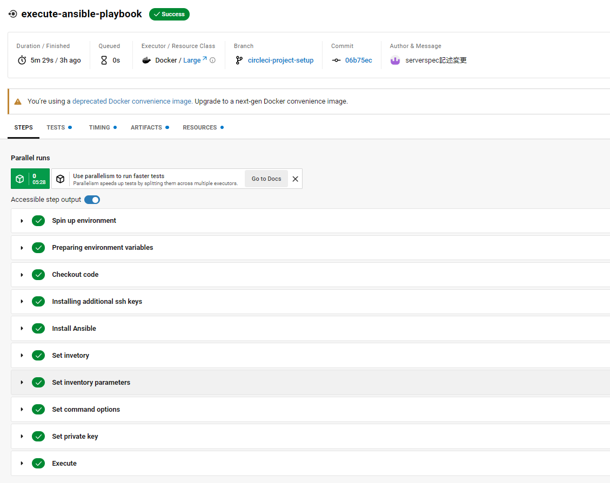

# 第13回講義課題

`・CircleCI のサンプルに ServerSpec や Ansible の処理を追加し結果を報告`

## 構成図

## 作業手順

### 使用ツール

1. CircleCI
   - Cloudformation、Ansible、serverspecの実行
  
2. Cloudformation

    - 第10回講義課題で作成したテンプレートを使用
    - VPC、EC2、ELB、RDS、S3、IAMを作成

3. Ansible
    - EC2へサンプルアプリケーション用の設定作業を行う
    - MySQL、Ruby、Nginx、puma

4. serverspec
    - ミドルウェア起動確認、アプリケーションレスポンス確認

### 環境変数の設定

- CircleCI:`Project Settings`にて`Environment Variables`から環境変数が設定できる
- 設定のカスタマイズ、機密情報の管理に必要なものを登録して使用

### CircleCIの実行結果

- ワークフロー完了画面

- Cloudformation

- Ansible-playbook

- serverspec

### アプリケーションの動作確認

- ELBのDNS名でアクセスし動作確認
